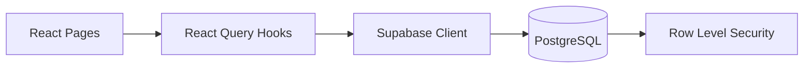
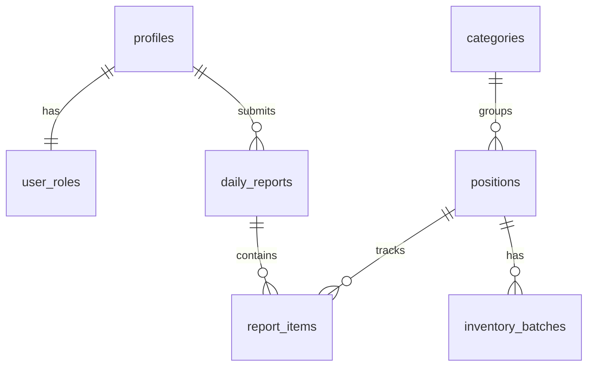

# ARQA Architecture

High-level architecture for the ARQA inventory and daily reporting system.

Last verified: 2026-02-07.

## Overview

ARQA is a React-based inventory and reporting app for cafes/restaurants.
- **barista** users submit daily stock reports and view their history.
- **manager** users manage inventory, warehouse arrivals, and reporting.

For contribution workflow, commands, and coding standards, see `AGENTS.md`.

## Core Architecture

### Runtime Flow

1. Route pages render UI and call domain hooks/services.
2. React Query handles fetch lifecycle, caching, and invalidation.
3. Supabase client executes queries with authenticated user context.
4. PostgreSQL + RLS enforce role-based data access.

### Application Layers

- `src/pages/`: route-level screens and feature orchestration.
- `src/components/`: reusable UI composition.
- `src/hooks/`: data access and stateful behavior.
- `src/services/`: domain logic (validation, notifications, calculations).
- `src/integrations/supabase/`: Supabase client and generated DB types.
- `src/lib/`: shared utility helpers.

## Data Model

### Main Tables

- `profiles`: user profile metadata.
- `user_roles`: role mapping (`barista` or `manager`).
- `categories`: product grouping.
- `positions`: inventory products and thresholds.
- `daily_reports`: end-of-day reports.
- `report_items`: per-position values in reports.
- `inventory_batches`: arrivals, cost, expiry.
- `notifications`: generated operational alerts.

### Main View

- `current_stock_levels`: aggregated current stock per position.

## Domain Rules

- Write-off formula: `previous_stock + arrivals - current_stock`.
- Low-stock alert: trigger when stock falls below `min_stock`.
- High write-off alert: trigger for significant waste events in daily reports.
