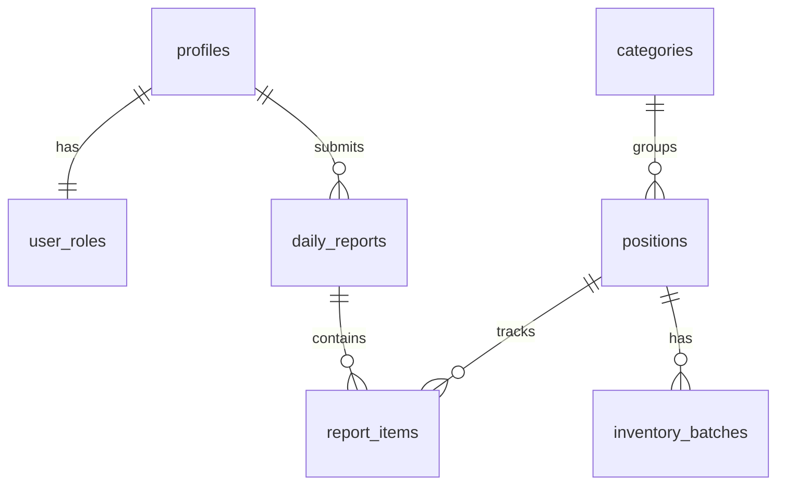
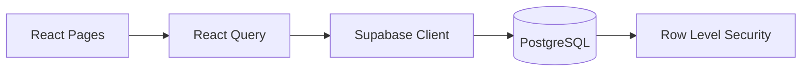

# ARQA Architecture

High-level architecture documentation for the ARQA inventory management system.

## Overview

ARQA is a React-based inventory and daily reporting system for cafés/restaurants. It enables baristas to submit daily stock reports and managers to oversee inventory, orders, and reporting.

## Tech Stack

- **Frontend**: React 18 + TypeScript + Vite
- **Styling**: Tailwind CSS + shadcn/ui components
- **Backend**: Supabase (PostgreSQL + Auth + Realtime)
- **State**: React Query (@tanstack/react-query) for server state
- **Routing**: React Router v6

## Project Structure

```
src/
├── components/       # Reusable UI components
│   └── ui/          # shadcn/ui base components
├── hooks/           # Custom React hooks
├── integrations/    # External service clients (Supabase)
├── lib/             # Utilities
└── pages/           # Route page components
```

## Data Model



### Key Tables

| Table | Purpose |
|-------|---------|
| `profiles` | User display names |
| `user_roles` | Role assignment (barista/manager) |
| `categories` | Product categories |
| `positions` | Inventory items (products) |
| `daily_reports` | Daily stock reports by baristas |
| `report_items` | Individual line items in reports |
| `inventory_batches` | Stock arrivals with cost/expiry tracking |
| `notifications` | System notifications for users |

### Key Views

- `current_stock_levels` - Aggregated current stock per position

## Core Subsystems

### 1. Daily Reporting (`DailyReport.tsx`)
Baristas submit end-of-day stock counts. The system calculates write-offs based on previous stock + arrivals - current stock. Low stock and high write-off alerts are generated automatically.

### 2. Position Management (`Positions.tsx`)
Managers configure inventory items with categories, units, shelf life, min stock thresholds, and order quantities.

### 3. Warehouse Management (`Warehouse.tsx`)
Tracks inventory arrivals, costs, and expiry dates. Supports Excel import for bulk arrivals.

### 4. Authentication
Uses Supabase Auth with role-based access. Two roles:
- **barista**: Can submit reports, view own history
- **manager**: Full access to all features and reports

## Data Flow



1. UI components use React Query hooks for data fetching
2. React Query manages caching and invalidation
3. Supabase client handles API calls with auth tokens
4. PostgreSQL with RLS ensures data access control
